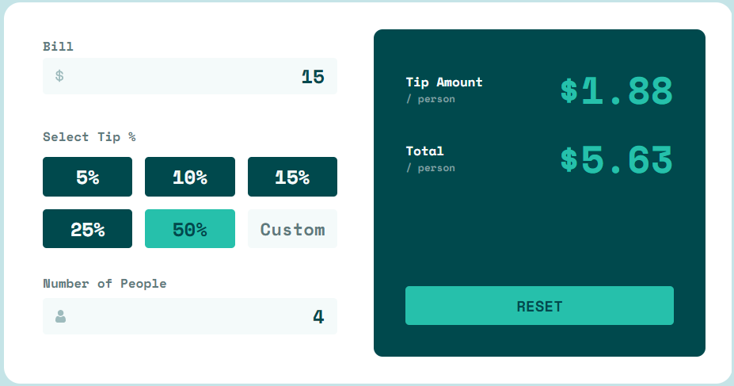
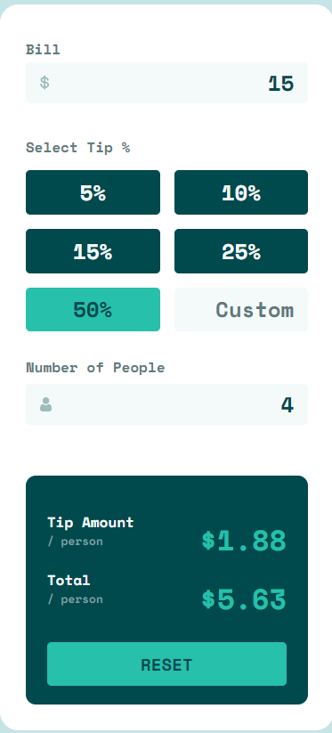
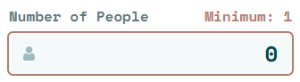

# Frontend Mentor - Tip calculator app solution

This is a solution to the [Tip calculator app challenge on Frontend Mentor](https://www.frontendmentor.io/challenges/tip-calculator-app-ugJNGbJUX). Frontend Mentor challenges help you improve your coding skills by building realistic projects.

## Table of contents

- [Overview](#overview)
  - [The challenge](#the-challenge)
  - [Screenshot](#screenshot)
  - [Links](#links)
- [My process](#my-process)
  - [Built with](#built-with)
  - [What I learned](#what-i-learned)
  - [Continued development](#continued-development)
  - [Useful resources](#useful-resources)
- [Author](#author)

## Overview

### The challenge

Users should be able to:

- View the optimal layout for the app depending on their device's screen size
- See hover states for all interactive elements on the page
- Calculate the correct tip and total cost of the bill per person

### Screenshot

The standard desktop layout


Mobile Layout


When a number less than one is entered into the people input box, an error shows up stating the minimum number of people is one.


### Links

- Solution URL: [Frontend Mentor](https://www.frontendmentor.io/solutions/responsive-tip-calculator-using-scss-css-grid-flexbox-Oa72TpRvJv)
- Live Site URL: [Github Pages](https://timmartin13-frontend-mentor.github.io/tip-calculator/)

## My process

### Built with

- Semantic HTML5 markup
- SCSS
- Flexbox
- CSS Grid
- Mobile-first workflow
- Local storage
- JavaScript


### What I learned

I used CSS Grid for the tip buttons and it was interesting learning something besides Flexbox for layouts.

The desktop grid is shown below:

```css
.tip-grid {
    grid-template-columns: 1fr 1fr 1fr;
    grid-template-rows: auto;
    gap: 1rem;
  }
```

### Continued development

While SCSS and HTML are fun, I need to start throwing all of this into React and Next.js

### Useful resources

- [Flexbox](https://css-tricks.com/snippets/css/a-guide-to-flexbox/) - I use this for every project
- [SCSS Architecture](https://matthewelsom.com/blog/simple-scss-playbook.html) - I found this to be the resource that I used the most when breaking up my SCSS
- [CSS Grid](https://css-tricks.com/snippets/css/complete-guide-grid/) - I used this for the CSS Grid reference and I am finding that css-tricks.com is very helpful.


## Author

- Website - [My portfolio](https://timmartin13.github.io/react-portfolio/)
- Frontend Mentor - [@TimMartin13](https://www.frontendmentor.io/profile/TimMartin13)
